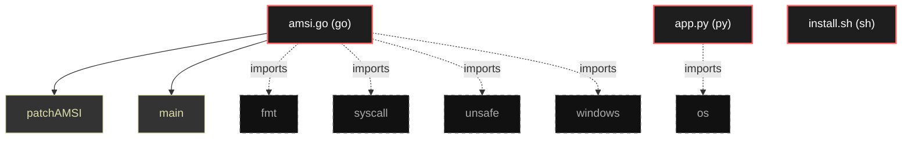

# Polyglot Codebase Knowledge Graph

> Generated offline by **readmenator**. Supports C, C++, Python, Go, Rust, JS/TS, Java, C#, Shell, PHP, Dart, GDScript, Nim, ASM, Ruby, Swift, Kotlin, Scala, Lua, Elixir.
> No LLMs. No tokens. Pure static analysis. See more [here](https://github.com/grisuno/ReadMenator)

**Total Files Parsed:** 3 | **Total Symbols Extracted:** 2 | **Total Imports:** 5

<!-- ranking_model: v1.0 | weights: {ppr:0.45,auth:0.2,test:0.15,doc:0.1,fresh:0.1} | alpha:0.85 | commit:75d209c | date:2026-07-18 -->


## Table of Contents

1. [Statistics Dashboard](#statistics-dashboard)
2. [Architectural Layers](#architectural-layers)
3. [Ranked Context](#ranked-context)
4. [God Nodes](#god-nodes)
5. [Suggested Questions](#suggested-questions)
6. [Hotspot Analysis](#hotspot-analysis)
7. [Change Impact Analysis](#change-impact-analysis)
8. [Orphans](#orphans)
9. [Query Recipes](#query-recipes)
10. [Structural Knowledge Map](#structural-knowledge-map)
11. [UML Class Diagram](#uml-class-diagram)
12. [Code Property Graph](#code-property-graph)
13. [Architecture Reference](#architecture-reference)
    - [GO (1 files)](#go-1-files)
    - [PY (1 files)](#py-1-files)
    - [SH (1 files)](#sh-1-files)

---

## Statistics Dashboard

| Metric | Value |
|--------|-------|
| Total Files | 3 |
| Total Symbols | 2 |
| Total Imports | 5 |
| Call Edges | 0 |
| Inheritance Edges | 0 |
| Languages | 3 |
| Avg Symbols/File | 0.7 |
| Avg Imports/File | 1.7 |

### Top Files by Import Count (Fan-Out)

| File | Imports | Symbols | Language |
|------|---------|---------|----------|
| `amsi.go` | 4 | 2 | go |
| `app.py` | 1 | 0 | py |

---

## Architectural Layers

Auto-detected from path patterns, naming conventions, and imported frameworks.

| Layer | Files |
|-------|-------|
| utility | 3 |

### utility

- `amsi.go` (go, 2 symbols)
- `app.py` (py, 0 symbols)
- `install.sh` (sh, 0 symbols)

---

## Ranked Context

Files ranked by composite score for the current query context. The ranking combines Personalized PageRank (query relevance), global authority, test coverage, documentation coverage, and code freshness. Model: v1.0.

| Rank | File | Composite | PPR | Authority | Test | Doc |
|------|------|-----------|-----|-----------|------|-----|
| 1 | `app.py` | 0.1000 | 0.0000 | 0.0000 | 0.00 | 1.00 |
| 2 | `amsi.go` | 0.0000 | 0.0000 | 0.0000 | 0.00 | 0.00 |
| 3 | `install.sh` | 0.0000 | 0.0000 | 0.0000 | 0.00 | 0.00 |

---

## God Nodes

Most architecturally central files ranked by combined import/export degree and symbol richness.

| File | Score | Connections | PageRank |
|------|-------|-------------|----------|
| `amsi.go` | 0.2 | | 0.0000 |
| `app.py` | 0.0 | | 0.0000 |
| `install.sh` | 0.0 | | 0.0000 |

---

## Suggested Questions

Auto-generated exploration prompts based on graph structure:

- What does amsi.go depend on, and what depends on it? (0 connections)
- What does app.py depend on, and what depends on it? (0 connections)
- What does install.sh depend on, and what depends on it? (0 connections)
- What is the overall architecture of this codebase?

---

## Hotspot Analysis

Files ranked by combined complexity (symbol count) and centrality (connection count). High-scoring files are architecturally critical and may need refactoring attention.

| File | Complexity | Centrality | Combined | Symbols | Connections |
|------|-----------|------------|----------|---------|-------------|
| `app.py` | 0.000 | 0.250 | 0.150 | 0 | 1 |
| `amsi.go` | 1.000 | 1.000 | 1.000 | 2 | 4 |
| `install.sh` | 0.000 | 0.000 | 0.000 | 0 | 0 |

---

## Change Impact Analysis

Files sorted by how many other files would be affected if they changed. High-impact files should be changed with caution.

| File | Direct Dependents | Transitive Dependents | Total Impact |
|------|------------------|----------------------|--------------|
| `amsi.go` | 0 | 0 | 0 |
| `app.py` | 0 | 0 | 0 |
| `install.sh` | 0 | 0 | 0 |

---

## Orphans

Files with no documentation or low connectivity. These are candidates for documentation investment or cleanup.

- `amsi.go` (2 symbols, no doc)
- `install.sh` (0 symbols, no doc)

---

## Query Recipes

Example queries you can run against this knowledge base using the ranking engine:

```
# Find files most relevant to a concept
readmenator query "Where is the import resolver implemented?"

# Rank files by relevance to a topic
readmenator query "How does documentation generation work?"

# Explain why a file ranks highly
readmenator query "explain readmenator/_documentation.py"

# Trace dependency paths with ranked context
readmenator query "path from CLI to exporter"
```

The ranking model uses the following signals:

- **Personalized PageRank** (45% weight): query-specific relevance via seed propagation
- **Global Authority** (20% weight): structural importance via standard PageRank
- **Test Coverage** (15% weight): fraction of symbols referenced in test files
- **Doc Coverage** (10% weight): presence of docstrings and file-level docs
- **Freshness** (10% weight): recent modification activity

Results include score decomposition and justification paths for each ranked item.

---

## Structural Knowledge Map



---

## Code Property Graph

Machine-readable Code Property Graph (CPG) in JSON-LD format. This block allows AI agents to parse the full structural graph without additional file reads. Compatible with GraphRAG pipelines.

```json
{"@context": "https://schema.org", "analysis": {"communities": [], "god_nodes": [{"node_id": "amsi.go", "score": 0.2}, {"node_id": "app.py", "score": 0.0}, {"node_id": "install.sh", "score": 0.0}], "surprising_connections": []}, "edges": [{"confidence": "EXTRACTED", "relation": "imports", "source": "amsi.go", "target": "fmt"}, {"confidence": "EXTRACTED", "relation": "imports", "source": "amsi.go", "target": "syscall"}, {"confidence": "EXTRACTED", "relation": "imports", "source": "amsi.go", "target": "unsafe"}, {"confidence": "EXTRACTED", "relation": "imports", "source": "amsi.go", "target": "golang.org/x/sys/windows"}, {"confidence": "EXTRACTED", "relation": "imports", "source": "app.py", "target": "os"}], "generator": "readmenator", "metadata": {"edge_count": 5, "file_count": 3, "language_count": 3, "symbol_count": 2}, "nodes": [{"id": "amsi.go", "kind": "module", "label": "amsi.go", "language": "go", "sha256": "cb9950756a48c83e", "symbol_count": 2, "symbols": [{"kind": "function", "line": 11, "name": "patchAMSI", "signature": "func patchAMSI("}, {"kind": "function", "line": 79, "name": "main", "signature": "func main("}]}, {"doc": "_*_ coding: utf8 _*_", "id": "app.py", "kind": "module", "label": "app.py", "language": "py", "sha256": "57b21bdb023585b8", "symbol_count": 0, "symbols": []}, {"id": "install.sh", "kind": "module", "label": "install.sh", "language": "sh", "sha256": "c907d80fd6734993", "symbol_count": 0, "symbols": []}], "type": "CodePropertyGraph", "version": "1.0"}
```

---

## Architecture Reference

### GO (1 files)

#### `amsi.go`
**Path:** `amsi.go`

**Functions:**
- `patchAMSI` (line 11) `func patchAMSI(`
- `main` (line 79) `func main(`

### PY (1 files)

#### `app.py`
**Path:** `app.py`
**File Doc:** *_*_ coding: utf8 _*_*

*No symbols extracted*

### SH (1 files)

#### `install.sh`
**Path:** `install.sh`

*No symbols extracted*
