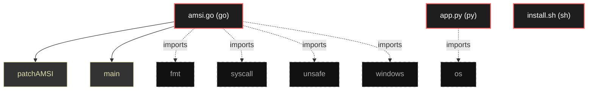

# Polyglot Codebase Knowledge Graph

> Generated offline by **readmenator**. Supports C, C++, Python, Go, Rust, JS/TS, Java, C#, Shell, PHP, Dart, GDScript, Nim, ASM.
> No LLMs. No tokens. Pure static analysis.

**Total Files Parsed:** 3 | **Total Symbols Extracted:** 2 | **Total Imports:** 5

## Structural Knowledge Map

---

## Architecture Reference

### GO (1 files)

#### `amsi.go`
**Path:** `amsi.go`

**Functions:**
- `patchAMSI` (line 11)
- `main` (line 79)

### PY (1 files)

#### `app.py`
**Path:** `app.py`

*No symbols extracted*

### SH (1 files)

#### `install.sh`
**Path:** `install.sh`

*No symbols extracted*
